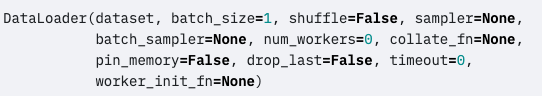
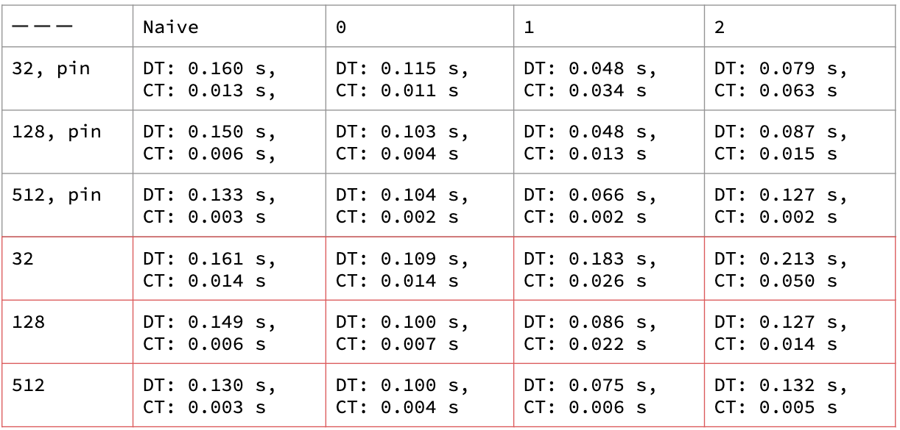

# Performance Enhancement in PyTorch Data Loader

## Introduction

Because GPUs become more powerful in recent years, we can shorten the training time of neural networks from several days to several hours. However, GPU's power can not be fully utilized if data are not fed to GPU in time. In this summary section, we will show how to extract data by using the PyTorch `DataLoader` module efficiently. 

## Application

#### Method

The above figure demonstrates the formulation of the `DataLoader`. There are mainly three parameters related to the speed: `batch_size`, `num_workers` and `pin_memory`.

* `batch_size`

In practice, using a large batch can better exploit the power of GPU by parallelization. But the performance might degrade a lot when the batch size is too large. Typically, increase batch size will decrease loading data time and training time.

* `num_workers`

`DataLoader` will use multiple processes to extract the data when `num_workers` greater than 0. There are three steps for `DataLoader` extracting the data. The first step is to create processes. Then, every process will fetch the data independently. The last step is to aggregate the data obtained by different processes. When we increase the `num_workers`, the cost of the second step decreases while which of the other steps increases. Therefore, increase `num_workers` not always speeding up the data loading.

* `pin_memory`

GPU can only fetch data from pinned memory. Therefore, we can reduce the time on copy data in CPU by moving the data to pinned memory first.

#### Result
To test the impacts of those parameters, we conduct experiments in sentiment analysis on the IMDB dataset. The results show that the `batch_size`, `num_workers`, `pin_memory` are optimal at `128`, `1`, and `True.`

## Conclusion 
There are several parameters in `DataLoader` related to the efficency issues. We could try to adust them to speed up the training process.