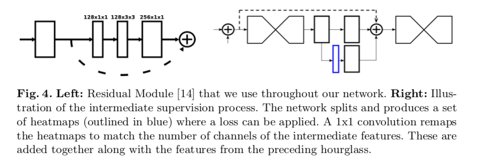
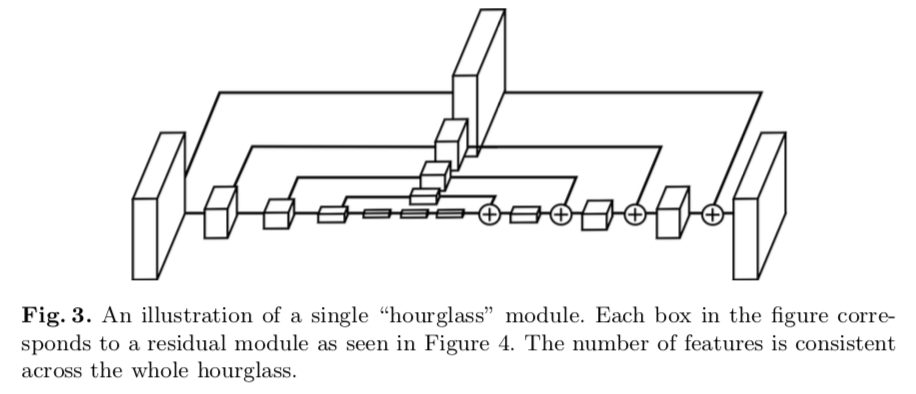
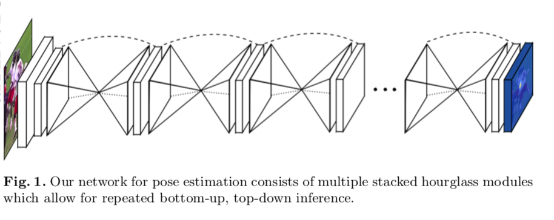
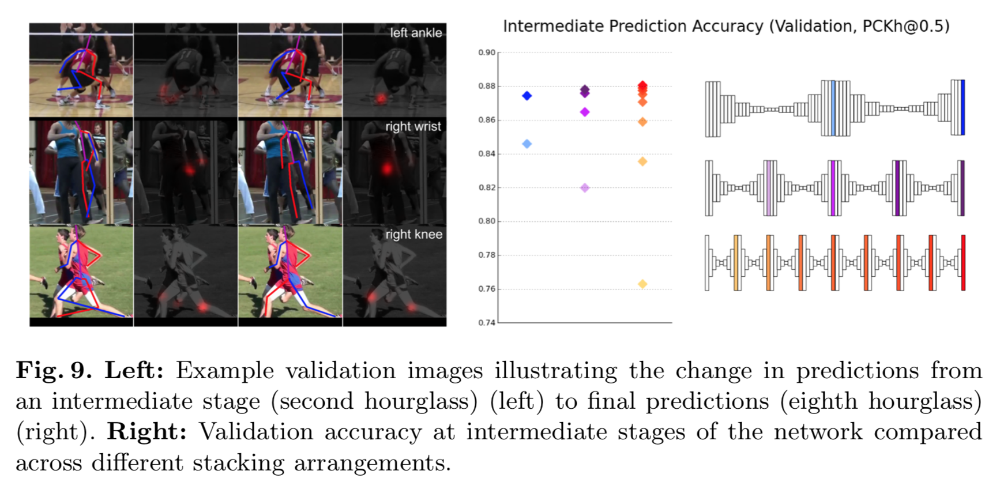

# Stacked Hourglass Networks for Human Pose Estimation

## Introduction

1. Human pose estimation
  - spatial relationships associated with the body
  - There records was 3 wins, 6 losses and a tie
2. Intermediate supervision
  - "stacked" the hourglasses
  - structure is novel

## Method

1. Structure of hourglass.

  - The hourglass network pools down to a very low resolution, then upsamples and combines features across multiple resolutions. (Similiar with "fully convolutional networks")
  - Uses simple nearest neighbor upsampling and skip connections for top-down processing.

2. Stacking the hourglasses together.

Expand on a single hourglass by consecutively placing multiple hourglass modules together end-to-end. This allows for repeated bottom-up, top-down in- ference across scales. In conjunction with the use of intermediate supervision, repeated bidirectional inference is critical to the network’s final performance. The final network architecture achieves a significant improvement on the state- of-the-art for two standard pose estimation benchmarks (FLIC and MPII Human Pose).

This enables intermediate supervision for every stage of hourglass output.

3. Object map output:

`[object class][embedding vector]`

Therefore for a chosen class and embedding, the output looks like a heatmap.

The design of embedding vector can be further used for link perdiction in interaction map, where the output in the form:

`[link class][source embedding][destination embedding]`

## Result

1. The powerful of stacking:

## Discussion

1. Effects of stacking hour glass (According to Author):
  - Get more consistent result. (Ex: 2 stacks of short hourglass > 1 stack of long hourglass)
  - Able to perform early start at inference, but the latter output of the stacks give better results. (Useful when you have time constraint at test time.)

