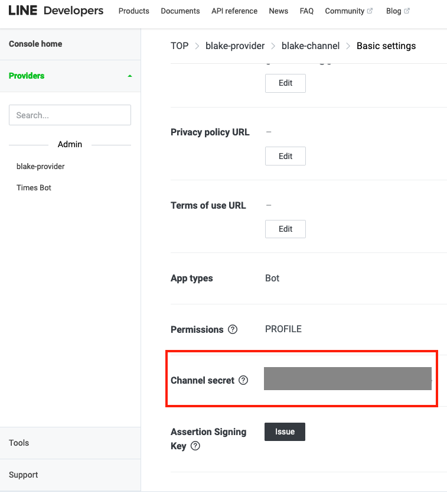
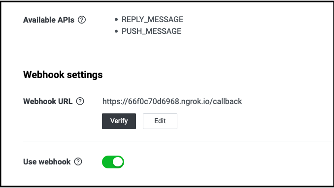
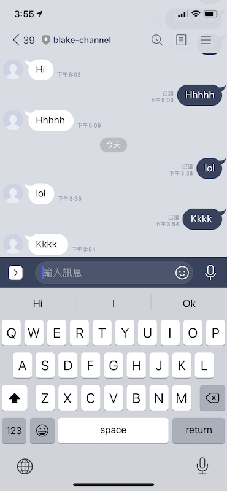

# line-bot-demo

1. Copy config file
   ```
   $ cp line-bot/config_template.yml line-bot/config.yml
   ```

2. Add your API token and secret key to config.yml
   
   
   
   ```
   $ vim config.yml
   ```
   
   ```
   Linebot:
    access_token: <CHANNEL ACCESS TOKE>
    secret: <CHANNEL SECRET>
   ```

2. Download model weights by dvc
   Install awscli and dvc
   ```
   pip install "dvc[s3]"
   pip install awscli
   aws configure
   ```
   Enter the `aws_access_key_id`, `aws_secret_access_key`
   
   Update the latest data by dvc
   ```
   $ dvc pull
   ```

3. Run app.py
   ```
   $ python line-bot/app.py
   ```
   
   

4. Run server
    1. Download [ngrok](https://ngrok.com/download) and save into 'line-bot/'
    2. Run server by using ngrok
       ```
       $ ./line-bot/ngrok http -host-header "localhost:5000" 5000
        ```
    3. Copy url to webhook to LINE developers
       
       
       
       
5. QA bot preview
    
    
   
